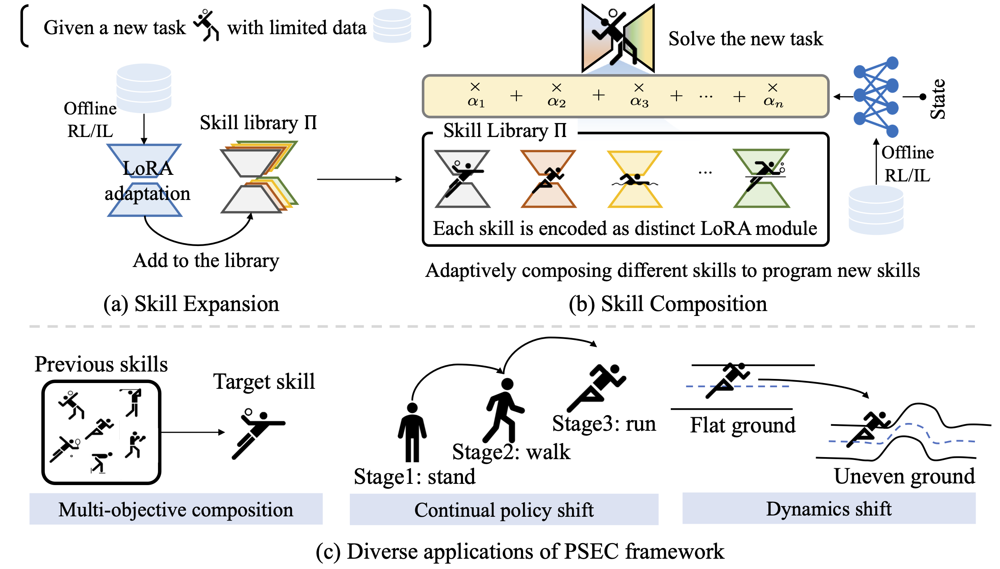

# PSEC: Skill Expansion and Composition in Parameter Space
International Conference on Learning Representation (ICLR), 2025 

Paper Link : <a href="https://arxiv.org/abs/2405.19909">
  .svg" alt="arXiv" style="vertical-align: middle;">
</a>


🔥 The official implementation of PSEC, a new framework
designed to **facilitate efficient and flexible skill expansion and composition, iteratively evolve the agents’ capabilities and  efficiently address new challenges**. 

<p float="left">

</p>

## Quick start
Clone this repository and navigate to PSEC folder
```python
git clone https://github.com/ltlhuuu/PSEC.git
cd PSEC
```
## Environment Installation
Environment configuration and dependencies are available in environment.yaml and requirements.txt.

Create conda environment for this experiments
```python
conda create -n PSEC python=3.9
conda activate PSEC
```
Then install the remaining requirements (with MuJoCo already downloaded, if not see [here](#MuJoCo-installation)): 
```bash
pip install -r requirements.txt
```

Install the [D4RL](https://github.com/Farama-Foundation/D4RL) benchmark

```bash
git clone https://github.com/Farama-Foundation/D4RL.git
cd d4rl
pip install -e .
```

### MuJoCo installation
Download MuJoCo:
```bash
mkdir ~/.mujoco
cd ~/.mujoco
wget https://github.com/google-deepmind/mujoco/releases/download/2.1.0/mujoco210-linux-x86_64.tar.gz
tar -zxvf mujoco210-linux-x86_64.tar.gz
cd mujoco210
wget https://www.roboti.us/file/mjkey.txt
```
Then add the following line to `.bashrc`:
```
export LD_LIBRARY_PATH=$LD_LIBRARY_PATH:~/.mujoco/mujoco210/bin
```
## Run experiments
### Pretrain for halfcheetah task
Pretrain the model with the following command.
```python
export XLA_PYTHON_CLIENT_PREALLOCATE=False
python run_pretrain_halfcheetah.py
```
### Pretrain for walker2d task
Pretrain the model with the following command.
```python
python run_pretrain_walker.py
```

### LoRA finetune
Train the skill policies with LoRA to achieve skill expansion and composition.
```python
python run_lora_finetune.py
```


## Citations
If you find our paper and code useful for your research, please cite:
```
@inproceedings{
liu2025psec,
title={Skill Expansion and Composition in Parameter Space},
author={Tenglong Liu, Jianxiong Li, Yinan Zheng, Haoyi Niu, Yixing Lan, Xin Xu, Xianyuan Zhan},
booktitle={International Conference on Learning Representations},
year={2025},
url={https://openreview.net/XXX}
}
```

## Acknowledgements

Parts of this code are adapted from [IDQL](https://github.com/philippe-eecs/IDQL).
